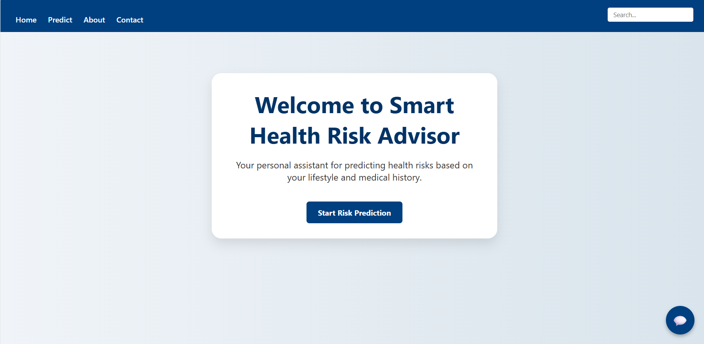
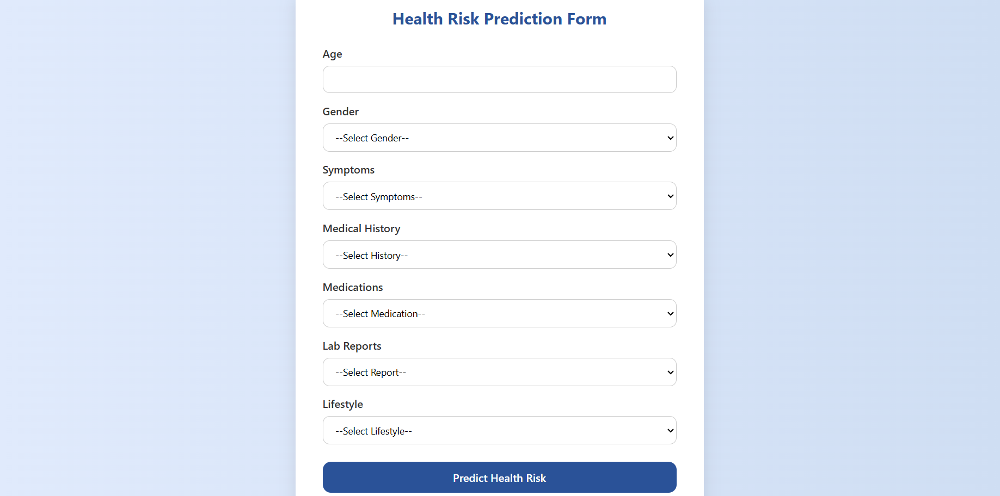
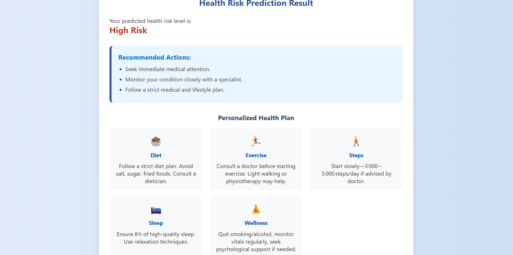
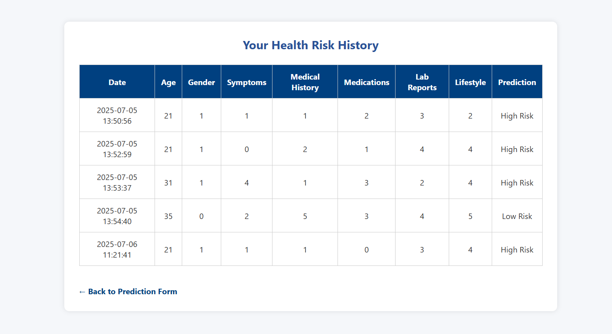

# Health Risk Predictor

A simple and intelligent health advisor web application that predicts your health risk level (Low, Medium, or High) based on lifestyle inputs using machine learning.

---

## Features

- ✅ Health risk prediction using ML (Random Forest)
- ✅ User-friendly form to input health and lifestyle habits
- ✅ Personalized suggestions based on predicted risk
- ✅ PDF report generation and download
- ✅ History tracking (locally stored)

---

## Tech Stack

- *Frontend*: HTML, CSS, JavaScript
- *Backend*: Python Flask
- *ML Model*: scikit-learn (Random Forest)
- *PDF Export*: `wkhtmltopdf`
- *Data Storage*: CSV or local file

---

## 📸 Screenshots

### 🏠 Home Page


### 📝 Input Form


### 📊 Prediction Result


### 📂 Health Risk History


---

## How to Run Locally

```bash
# Clone the repository
git clone https://github.com/Ramyavelu2420/Health-Risk-Predictor.git
cd Health-Risk-Predictor

# Create virtual environment (optional but recommended)
python -m venv venv
venv\Scripts\activate  # On Windows

# Install dependencies
pip install -r requirements.txt

# Run the app
python app.py
